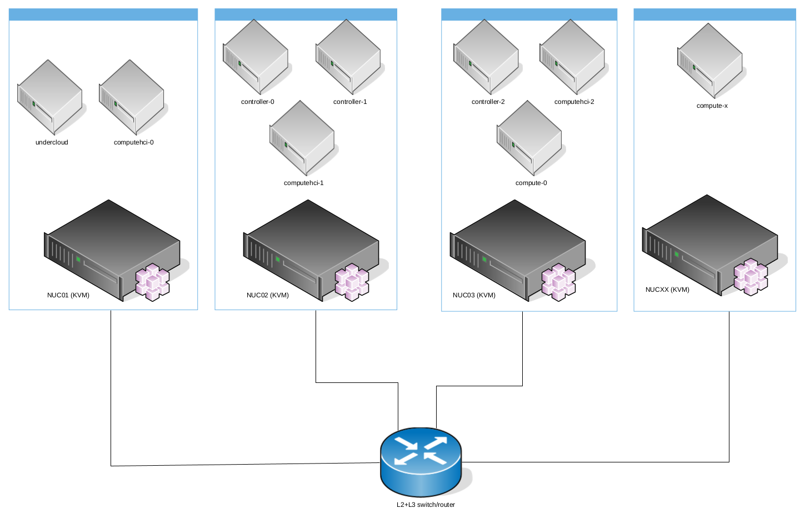

rhosp16-in-the-jars
=====================
Introduction
------------
I use those Ansible playbooks to install RHOSP 16.1 on a couple of (similar) Intel NUC, to test undercloud and overcloud functionalities.

You can use them, from only one host, for example an Intel NUC host, to unlimited hosts, but all RHOSP hosts will be created as virtual machine with nested virtualization upon your NUCs.



**Warning:** This project / repository / playbooks should be used **only for testing** RHOSP 16.x platform and **NOT** for production environment.

Requirements
------------
### Operating System and packages
Your Linux NUC hosts requires the following **packages** installed and working:

- libvirt
- qemu
- nested virtualization
- libguestfs
- virtualbmc
- ssh

there are no constraint on which Linux distribution to use, for example I use Gentoo, but you can use RHEL, CentOS, Ubuntu, Arch... for example to set up a similar project on a Cloud dedicated CentOS server I used this Ansible playbook:

[prepare-hetzner-hypervisor](https://github.com/amedeos/rhosp-lab-amedeos/blob/master/prepare-hetzner-hyperivsor.yaml)

if you use Gentoo, like me, you can simply install the required packages from the Portage and virtualbmc from my overlay "amedeos"

### Layer2 and Layer3
In my homelab I used a layer2+layer3 switch from Netgear, its very sinple and cheaper managed switch (I paid for Netgear GS108TV3 ~70 bucks), but remember, if you want to use more than one NUC, you will need to connect all your NUCs to one switch in order to use the required VLANs.

The Ansible Playbooks will use the following VLANs for RHOSP:

| VLAN | Name | Subnet | Native | Gateway |
| ---- | ---- | ------ | ------ | ------- |
| 2000 | InternalApi | 192.168.200.0/24 | |
| 2001 | Provisioning | 192.168.201.0/24 | True | 192.168.201.1 |
| 2002 | Management | 192.168.202.0/24 | | |
| 2003 | External | 192.168.203.0/24 | | 192.168.203.1 |
| 2004 | Storage | 192.168.204.0/24 | | |
| 2005 | StorageMgmt | 192.168.205.0/24 | |
| 2006 | Tenant | 192.168.206.0/24 | |
| 2007 | FloatingIP | 192.168.207.0/24 | | 192.168.207.1 |

### vCPU and vRAM
OpenStack requires various hosts, below the list of Virtual Machines created and their flavor:

| VM | Role | vCPU | vRAM | Disks |
| -- | ---- | :----: | :----: | :-----: |
| undercloud | undercloud | 4 | 24G | 1x100G |
| controller-1 | Controller | 2 | 16G | 1x100G |
| controller-2 | Controller | 2 | 16G | 1x100G |
| controller-3 | Controller | 2 | 16G | 1x100G |
| compute-1 | Compute | 2 | 12G | 1x100G |
| compute-2 | Compute | 2 | 12G | 1x100G |
| ceph-1 | CephStorage | 2 | 12G | 1x100G + 3x200G |
| ceph-2 | CephStorage | 2 | 12G | 1x100G + 3x200G |
| ceph-2 | CephStorage | 2 | 12G | 1x100G + 3x200G |
| | | | | |
| | **Total:** | **20** | **132G** | **1.5T** |

The most critical resource is the vRAM, because all hosts, during the overcloud deploy will be memory consuming; instead all disks will be created in thin provisioning and for this reason a clean deploy will take up to 10-15% provisioned space.

### RHEL 8.2 qcow2
You need to download from Red Hat customer portal the RHEL 8.2 qcow2 file and make it available for download in the NUC that will be the KVM host for the undercloud VM.

**Note:** only the undercloud VM will be generated starting from this qcow2 file, all overcloud nodes will be installed and configured, as usual, by the undercloud host.

Configurations for your environment
-----------------------------------
### variables.yaml
Open **variables.yaml** and edit all variables do you need to fit your requirements, but most important, you must change these variables:

| Variable | Description |
| :------- | :---------: |
| secure_password | Password used for root and stack user |
| rh_subcription_user | Your Red Hat Customer Portal username |
| rh_subcription_password | Your Red Hat Customer Portal password |
| rh_subcription_pool | Your Red Hat Subscription Pool ID for RHOSP |
| image_location | RHEL 8.2 qcow2 URL |

### overcloud-ansible-nodes.json
Edit this file mapping all VM to your NUC hosts, if you use "localhost", then the Ansible local connection will be used, otherwise Ansible will use ssh connection.

Install undercloud and overcloud
--------------------------------
In order to install either undercloud and overcloud nodes you can simply run the **deploy-rhosp16.sh** script passing to it only the Ansible vault file

```bash
# ./deploy-rhosp16.sh <ansible-vault-file>
```


